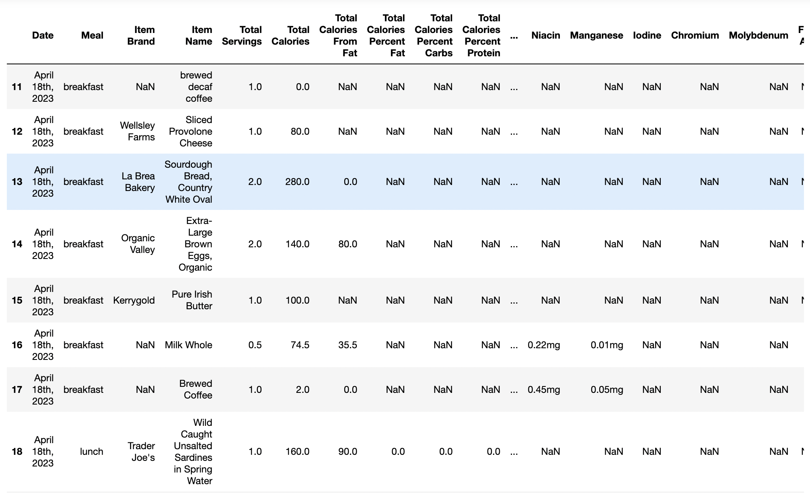

# MyPlate Parser

A Python package that parses and transforms Livestrong MyPlate app's detailed-level meal tracking data into a more user-friendly format.

## Introduction

MyPlate Parser is a Python package designed to simplify the extraction and analysis of detailed meal tracking data from the Livestrong MyPlate app. The app's exported files, in the .xls format, contain semi-structured data with daily sub-tables, each day having a mix of detailed data and a daily summary. These files are inconveniently structured, particularly for those hoping to perform their own analysis or apply classification or other machine learning algorithms. MyPlate Parser addresses this challenge by transforming the semi-structured data into a structured DataFrame as a more convenient starting point for further cleaning, transformation and analysis.

By parsing the app's exported files, MyPlate Parser provides a structured DataFrame, allowing users to easily explore and analyze their dietary information. The package also overcomes a (seemingly benign) "Workbook corruption" issue, which users will likely encounter when attempting to use conventional tools like Pandas and xlrd to read detailed-level export files.

## Features

- Parses Livestrong MyPlate app detailed export files provided in .xls format
- Handles the "Workbook corruption" issue encountered when using Pandas or xlrd
- Extracts and transforms semi-structured meal data into a final structured DataFrame
- Returns the final DataFrame containing the extracted meal data

## Installation

You can install the MyPlate Parser package using pip:

```shell
pip install myplate-parser
```

## Usage

### Visit [Livestrong MyPlate](https://www.livestrong.com/myplate/), login and download your meal tracking data:


 Tip: Selecting a range greater than six months will typically cause the download job to fail. If more
  than six months' worth of data is desired, download separate files in up to six month increments.

### Once you've retrieved your data:

```python
from myplate_parser.mypparser import MyPlateDetailedExportParser

# Create an instance of the parser
parser = MyPlateDetailedExportParser()

# Get the DataFrame containing extracted meal data
meals_df = parser.get_meals_df("path/to/your/file.xls")

# Perform further cleaning and analysis on the meals_df DataFrame
# ...
```

### 'Before' / Semi-Structured .xls Example:


### 'After' / Structured DataFrame Example:



## Requirements

The MyPlate Parser package has the following requirements:

- Python 3.x
- Pandas

## Planned Work
Here are some planned improvements in the pipeline:

Fixing Nutritional Values: Currently, some nutritional values are provided as strings that include the units (e.g., `'123mg'`). The planned work involves converting these strings into numerical values and updating the column headings to indicate the units accurately.

Date Column Conversion: The date column values in the DataFrame are currently stored as inconveniently formatted strings (e.g., `'April 19th, 2023'`). There is an open issue to convert these values into date objects, allowing for easier date-based analysis and filtering.

## Contribution

Contributions are welcome! If you encounter any issues or have suggestions for improvements, please create an issue or submit a pull request on the [GitHub repository](https://github.com/benco5/myplate-detailed-export-parser).

## License

This project is licensed under the [MIT License](LICENSE).